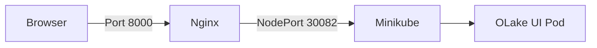

# OLake UI Deployment using Terraform, Helm, and Minikube

This project demonstrates automated deployment of OLake UI on AWS using Infrastructure as Code (IaC) principles.

## Architecture Overview

### Components Flow


### Key Components
- **AWS EC2**: Hosts the entire infrastructure
- **Minikube**: Single-node Kubernetes cluster for local development
- **Helm**: Package manager for Kubernetes applications
- **Nginx**: Reverse proxy server for traffic routing

## Project Structure
```
.
├── main.tf         # Terraform infrastructure configuration
├── variables.tf    # Variable definitions
├── outputs.tf      # Output configurations
├── setup.sh        # Infrastructure setup script
├── values.yaml     # Helm chart values
└── screenshots/    # Contains required screenshots
```

## Prerequisites

### Required Tools
- AWS CLI (configured with `olake-assignment` profile)
- Terraform (v1.5 or later)
- Valid SSH key pair (named `olake-ssh.pem`)

### AWS IAM Requirements
Ensure your IAM user has permissions for:
- EC2 instance management
- VPC operations
- Security group configuration
- Key pair operations

## Deployment Instructions

1. **Initialize Terraform**
   ```bash
   terraform init
   ```

2. **Review Changes** (Optional)
   ```bash
   terraform plan
   ```

3. **Deploy Infrastructure**
   ```bash
   terraform apply -auto-approve
   ```

   The deployment process will:
   - Create required security groups
   - Launch EC2 instance
   - Execute setup script
   - Install and configure required tools
   - Deploy OLake via Helm

## Accessing the Application

1. Get the EC2 public IP from Terraform outputs
2. Access OLake UI through:
   ```
   http://<EC2_PUBLIC_IP>:8000/app/
   ```

## Cleanup

To remove all created resources:
```bash
terraform destroy
```